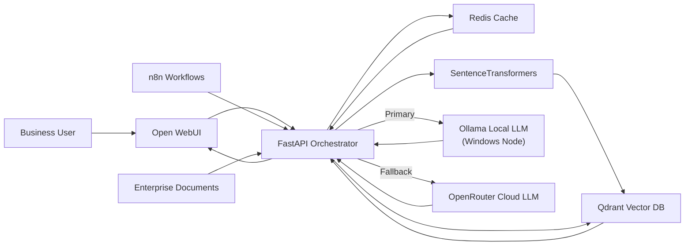

# Enterprise AI Gateway — Intelligent Multi-LLM Routing Platform


A policy-driven AI gateway that **classifies every incoming query across six dimensions** (complexity, domain, sensitivity, context size, RAG need, latency) and **routes it to the optimal LLM** — balancing cost, quality, governance, and resilience across GPT-4o, GPT-5, Claude, Gemini, and on-premises models.

Built as an architecture portfolio artefact demonstrating patterns relevant to:

- Enterprise AI Architect
- GenAI Solution Architect
- Data Platform Architect
- Cloud AI Transformation Lead

---

## Problem Statement

Enterprises adopting AI face a common set of architectural challenges:

- **Which model should we use?** Different queries need different capabilities — a simple factual question shouldn't consume GPT-5 tokens.
- **How do we reduce AI costs?** Per-token pricing across multiple vendors is unpredictable and hard to govern.
- **How do we maintain quality?** Complex reasoning tasks need premium models; simple tasks don't.
- **How do we comply with governance?** Confidential data must stay on-premises; public data can use cloud APIs.
- **How do we avoid vendor lock-in?** A single-provider strategy creates dependency and pricing risk.

This gateway addresses all of these by introducing an **intelligent routing layer** between users and LLM providers:

- **Multi-dimensional query classification** — every query is analyzed for complexity, domain, sensitivity, context size, RAG need, and latency requirements
- **Policy-driven model selection** — a Decision Engine evaluates routing policies (governance, FinOps, complexity, confidence) to select the optimal model
- **Cost-aware routing** — Redis-backed budget tracking downgrades to cheaper models when spend caps are exceeded
- **Vendor-neutral architecture** — OpenRouter abstraction provides access to GPT, Claude, Gemini, and local models through a single API
- **RAG orchestration** — conditional retrieval grounds answers in enterprise documents when needed
- **Semantic response caching** — eliminates redundant model calls
- **Intelligent fallback** — ordered fallback chain ensures resilience when a provider fails

---

## Architecture



### Request flow

```
User Query
  └─► FastAPI (embed query)
        └─► Qdrant (retrieve top-k chunks)
              └─► Redis (cache lookup)
                    ├─ HIT  → return cached answer
                    └─ MISS → Ollama (primary)
                                └─ FAIL → OpenRouter (fallback)
                                            └─► Redis (write)
                                                  └─► User
```

See [`docs/architecture/architecture-overview.md`](docs/architecture/architecture-overview.md) for full layer breakdown.

---

## Repository Structure

```text
.
├── README.md
├── docker-compose.yml
├── .env.example
├── src/
│   ├── api/
│   │   ├── main.py               # FastAPI application entry point
│   │   ├── dependencies.py       # Shared dependency injection
│   │   └── routers/
│   │       └── query.py          # Query endpoint with routing logic
│   ├── inference/
│   │   ├── router.py             # Primary/fallback provider routing
│   │   ├── ollama_client.py      # Local inference client
│   │   └── openrouter_client.py  # Cloud inference client
│   ├── retrieval/
│   │   ├── embedder.py           # SentenceTransformer embedding wrapper
│   │   └── qdrant_client.py      # Vector store operations
│   ├── cache/
│   │   └── redis_cache.py        # Prompt-keyed response cache
│   └── models/
│       └── schemas.py            # Pydantic request/response schemas
├── scripts/
│   ├── ingest_documents.py       # Document ingestion and indexing
│   └── health_check.py           # Platform component health checks
└── docs/
    ├── architecture/
    │   ├── architecture-overview.md
    │   └── hybrid-ai-platform.mmd
    ├── adr/
    │   ├── 0001-local-first-hybrid-inference.md
    │   ├── 0002-redis-response-cache.md
    │   └── 0003-distributed-ollama-node.md
    ├── runbooks/
    │   └── local-operations.md
    └── case-study/
        └── local-first-hybrid-ai-platform.md
```

---

## Quick Start

### Prerequisites

- Docker & Docker Compose
- Python 3.11+ (for scripts)
- Ollama installed on a local node ([ollama.ai](https://ollama.ai))
- OpenRouter API key (optional, for cloud fallback)

### 1. Clone and configure

```bash
git clone https://github.com/your-username/local-first-hybrid-ai-platform.git
cd local-first-hybrid-ai-platform
cp .env.example .env
# Edit .env with your values
```

### 2. Pull a local model

```bash
ollama pull gemma2:9b
```

### 3. Start the platform

```bash
docker compose up -d
```

### 4. Ingest documents

```bash
pip install -r scripts/requirements.txt
python scripts/ingest_documents.py --input-dir ./sample-docs
```

### 5. Open the UI

Navigate to [http://localhost:3000](http://localhost:3000)

---

## Core Design Decisions

Architecture Decision Records document all major trade-offs:

| ADR | Decision | Status |
|-----|----------|--------|
| [0001](docs/adr/0001-local-first-hybrid-inference.md) | Adopt local-first hybrid inference strategy | Accepted |
| [0002](docs/adr/0002-redis-response-cache.md) | Introduce Redis as a response cache | Accepted |
| [0003](docs/adr/0003-distributed-ollama-node.md) | Support a distributed Ollama inference node | Accepted |

---

## Technology Stack

| Layer | Technology |
|-------|-----------|
| Orchestration | FastAPI, Python 3.11, Pydantic v2 |
| Embedding | SentenceTransformers (`all-MiniLM-L6-v2`) |
| Vector Store | Qdrant |
| Local Inference | Ollama (Gemma 2 9B) |
| Cloud Inference | OpenRouter (abstracted provider) |
| Caching | Redis |
| UI | Open WebUI |
| Workflow Automation | n8n |
| Infrastructure | Docker Compose, Ubuntu host |

---

## Roadmap

- [ ] Complexity-based query routing (route by token estimate)
- [ ] Session memory for multi-turn conversation context
- [ ] LLMOps observability (LangSmith / Arize integration)
- [ ] RBAC for document collection access
- [ ] FinOps dashboard (token cost tracking per query)
- [ ] Streaming response support

---

## Portfolio Context

This project is an architecture portfolio artefact. It is intentionally scoped to demonstrate:

- **Intelligent multi-LLM routing** via a policy-driven Decision Engine
- **Multi-dimensional query classification** (complexity, domain, sensitivity, cost, RAG, latency)
- **Cost-aware routing** with Redis-backed budget enforcement (FinOps)
- **Governance-aware routing** — confidential data stays on-premises
- **Vendor-neutral architecture** — GPT, Claude, Gemini, and local models through one API
- **Enterprise RAG patterns** with grounded, context-constrained responses
- **Architectural decision making** documented via ADRs
- **Operational thinking** via runbooks and deployment topology

> **Portfolio positioning:** Designed and implemented an Enterprise AI Gateway — a policy-driven intelligent routing platform that classifies queries across six dimensions and selects the optimal LLM based on complexity, sensitivity, cost budget, and latency. Integrates FastAPI, LangGraph-style orchestration, Qdrant/pgvector, Redis, and OpenRouter to provide vendor-neutral, governance-aware, cost-optimised multi-model inference.

---

## License

MIT
