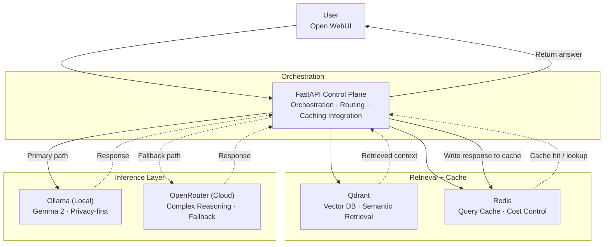

# Building a *Local-First* Hybrid AI Platform

**Portfolio Case Study — Enterprise GenAI Architecture**

From prototype to enterprise-ready GenAI architecture — balancing data privacy, inference cost, and operational resilience through a modular, routing-aware design.

**Stack:** FastAPI · Qdrant · Ollama · Redis · OpenRouter  
**Concepts:** RAG · Hybrid Inference · LLMOps · Enterprise Architecture  

---

## Executive Summary

| Area | Details |
|------|--------|
| **The Problem** | Enterprises want AI-powered insights without exposing sensitive data to cloud LLMs or absorbing unpredictable per-token costs. |
| **The Architecture** | Local-first hybrid inference platform routing queries to local models first, with cloud fallback and semantic caching. |
| **Primary Outcome** | Sensitive data remains on-prem. Repeated queries served via cache. Cloud is used selectively. |
| **Pattern** | **RAG + Hybrid Routing + Caching Layer** |

---

## Motivating Use Case

A mid-sized energy company needed to analyze vendor contracts and compliance documents without exposing sensitive legal data externally.

### Key Challenges

- **Sensitive Data Constraint**  
  Contracts include confidential financial and regulatory information.

- **Cost at Scale**  
  Repeated queries lead to rising token costs.

- **Response Consistency**  
  Business workflows require deterministic outputs.

---

## Architecture Diagram

### Architecture Notes

- **Primary inference path:** Ollama (local)
- **Fallback inference path:** OpenRouter (cloud)
- **Retrieval:** Qdrant
- **Caching:** Redis
- **Orchestration layer:** FastAPI

---

## Request Flow

1. **Query Ingestion**  
   User submits query via Open WebUI → FastAPI receives it.

2. **Semantic Retrieval (Qdrant)**  
   Top-k relevant document chunks retrieved.

3. **Cache Lookup (Redis)**  
   - Cache hit → instant response (no LLM call)

4. **Inference Routing**
   - Primary → Local (Ollama / Gemma 2)
   - Fallback → Cloud (OpenRouter)

5. **Cache Write + Response**
   - Response stored in Redis
   - Returned to user

---

## Technology Stack

### Orchestration
- FastAPI  
- Python 3.11+  
- Pydantic  

### Retrieval
- Qdrant  
- Sentence Transformers  
- LangChain  

### Inference
- Ollama  
- Gemma 2 (9B)  
- OpenRouter  

### Infrastructure
- Redis  
- Ubuntu  
- Docker Compose  
- Open WebUI  

---

## Design Principles

### 1. Privacy — Local-first inference
Sensitive data processed locally. Cloud is fallback only.

### 2. Resilience — Graceful degradation
Automatic fallback to cloud if local fails.

### 3. Economics — Cost-aware caching
Redis eliminates redundant LLM calls.

### 4. Modularity — Component independence
Each layer is swappable (no vendor lock-in).

---

## Measured Benefits

| Capability | Mechanism |
|-----------|----------|
| **Data Privacy** | Local inference via Ollama |
| **Cost Control** | Redis eliminates repeated LLM calls |
| **Latency** | Cache hits <10ms |
| **Resilience** | Automatic fallback to cloud |
| **Vendor Neutrality** | OpenRouter abstracts providers |

---

## Lessons Learned

- **Local models are viable**  
  For constrained enterprise use cases, quality is sufficient.

- **Caching = highest ROI**  
  Can reduce cost by **60–80%**.

- **Routing logic is critical**  
  Must explicitly decide local vs cloud usage.

- **Simplicity matters**  
  Every component adds operational overhead.

---

## Roadmap

- Intelligent query routing (complexity-based)
- Session memory (multi-turn context)
- LLMOps observability (LangSmith / Arize)
- RBAC for document access
- Model performance benchmarking
- FinOps dashboard (cost tracking)

---

## Portfolio Positioning Statement

> Designed and implemented a local-first hybrid GenAI platform integrating FastAPI, Qdrant, Ollama, Redis, and OpenRouter — enabling privacy-aware enterprise document intelligence with semantic caching and resilient multi-tier inference routing.
